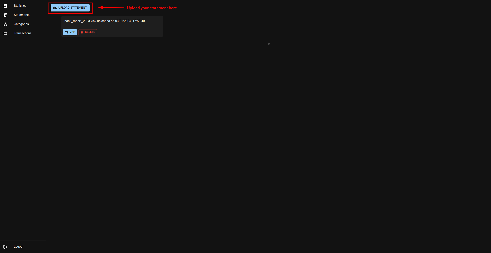
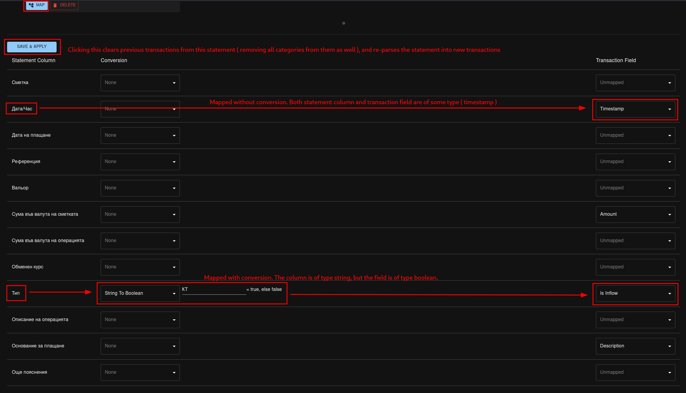
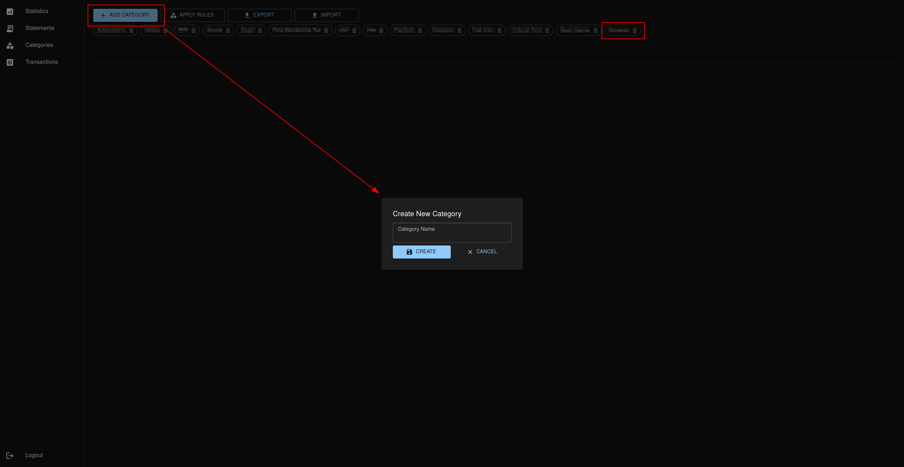
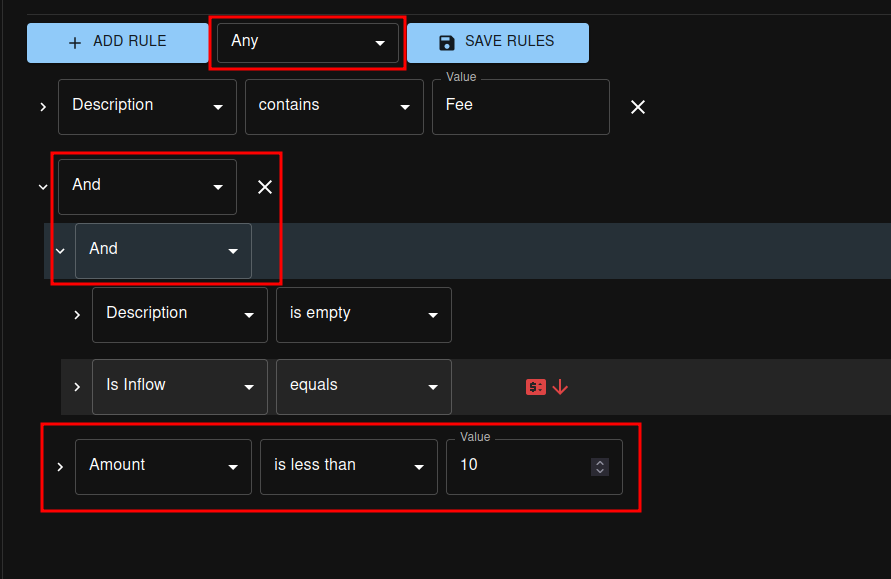
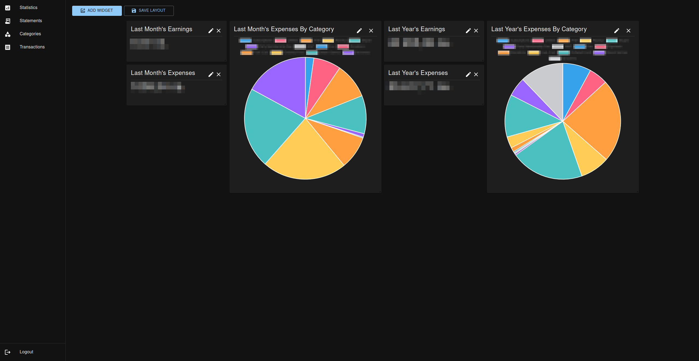
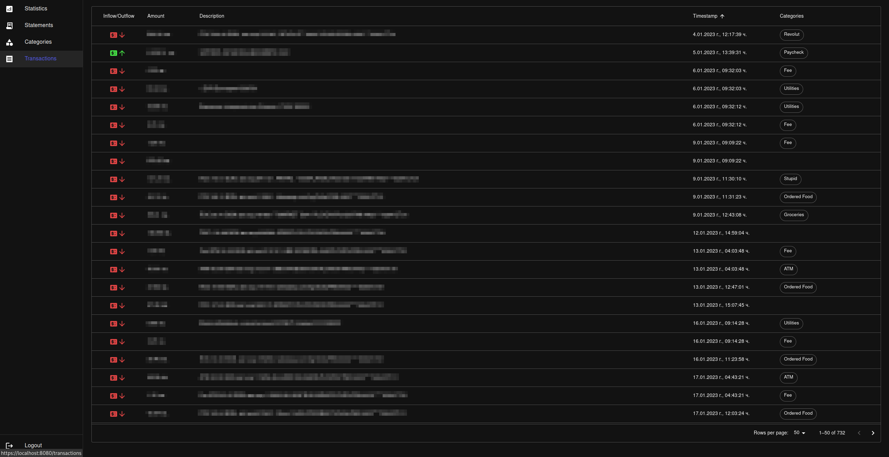
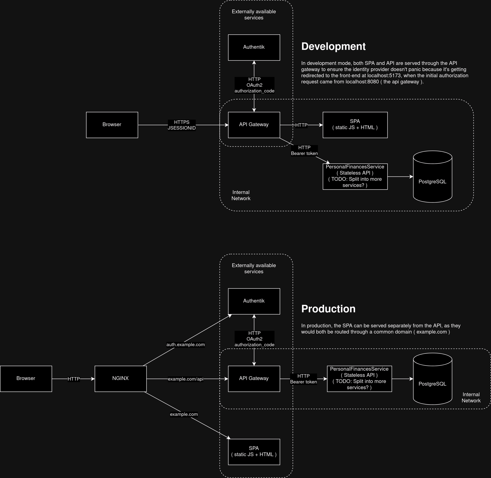

# Personal Finances

This is a web application I use to keep track of my own finances. It's open source, so if you've 
come across this repository, know that you are welcome to use it for yourself!

## Features

### Upload Statements

The first step in using the Personal Finances app is to upload your bank statement.
It is expected to be in an spreadsheet format, with 1 sheet inside, where each transaction
is on a separate row. The application currently only has the ability to parse columns with
simple types, no formulas or combined rows or anything like that.

#### Mapping

Once uploaded, it is necessary to map the spreadsheet data into the standard transaction format
of the application. This is done via the same page where the statement is uploaded, by clicking the `Map`
button. Once clicked, you have the ability to map columns from the sheet into fields of the transaction, based on their type.

### Categorize Your Transactions

To make full use of the available feature-set, you need to categorize every transaction. This is because different banks
have different formats for how they describe things like the cause of a transaction. Categories are there to make the whole
process easier. One transaction in the application can be assigned multiple categories.

To create a new category, go to the Categories page, and click the `Add Category` button.
It's possible to export and import categories as well, in case you wish to experiment a little with your
categorizations, but don't want to lose your previous category definitions.

#### Configure Categorization Rules

Once a category is created, in order to apply it to transactions, you must define some categorization rules.
This happens by clicking on the category chip in the Categories page, and on the lower half of the page, a new
menu will appear, allowing you to define your rules.

You can pick one of 3 behaviors for a category when it comes to evaluating rules: `Any ( Default )`, `All`, or `None`:
* `Any` - any of the defined rules must evaluate to true in order for the category to be assigned to the transaction
* `All` - all of the defined rules must evaluate to true
* `None` - none of the defined rules must evaluate to true

Each category holds multiple categorization rules. Each rule can be configured to look at a field directly, or a combination
of other rules ( via the `And`, `Or` or `Not` rules ).

### Statistics

Once categories have been defined, and transactions categorized, you can make use of the Statistics page to define widgets.

Widgets come in several types, but their general purpose is to aggregate information from your transactions based on your categories,
and display it to you in a human-friendly manner. The layout of the widgets is free-form, each one can be placed freely 
on the page, allowing you to create your own personal financial dashboard.

## Setup

The Personal Finances application is actually 3+1 separate applications. The first 3 can be found in this very repository,
and they are the frontend, the API gateway, and the PersonalFinancesService. The +1 mentioned is actually the authorization
provider, which in theory could be anything that supports OpenIDConnect or OAuth2. My personal auth provider `auth.mvvasilev.dev`
uses the awesome [Authentik](https://github.com/goauthentik/authentik) project.

### Browse Your Transactions

You can access your parsed transactions from the `Transactions` page

### Building Docker Images

/* TODO */

### Docker Compose

/* TODO */

### Network Architecture / Topology
